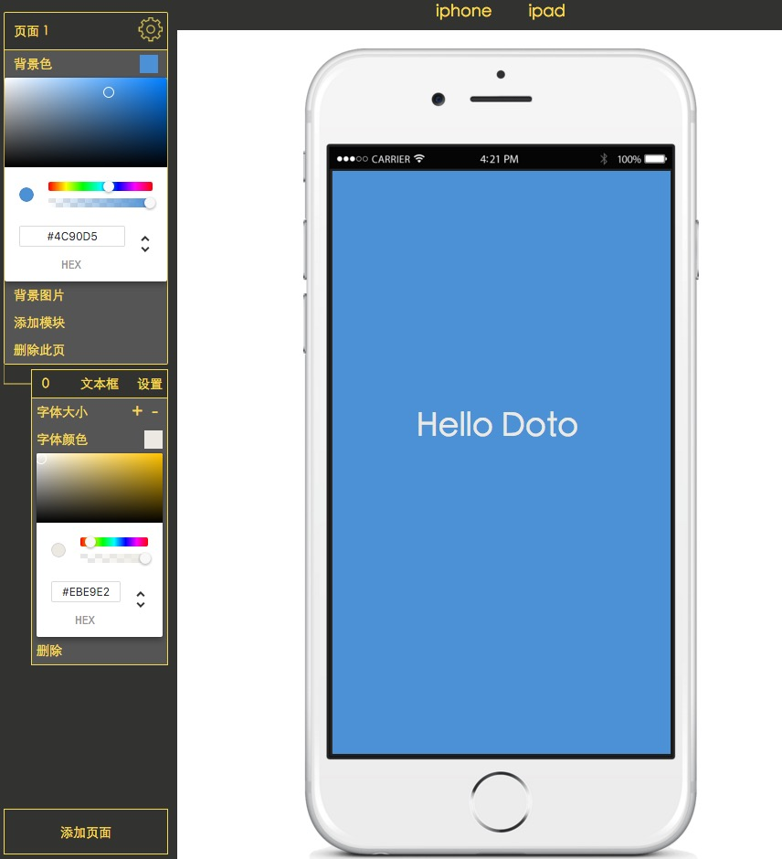

# Doto

### 由Redux&React&webpack构建的H5运营页制作工具（未完成，欢迎fork，共同开发）

#### a slight H5 webpage generator construced in Redux,React and webpack(developing)




### 部署流程：

#### 1. 安装Nodejs环境

#### 2. 拉取项目文件

```
git pull git@github.com:ihardcoder/Doto.git
```

#### 3. 进入项目根目录执行

```
npm install
```

安装完毕后执行

```
npm start
```

访问`localhost:3000`即可
